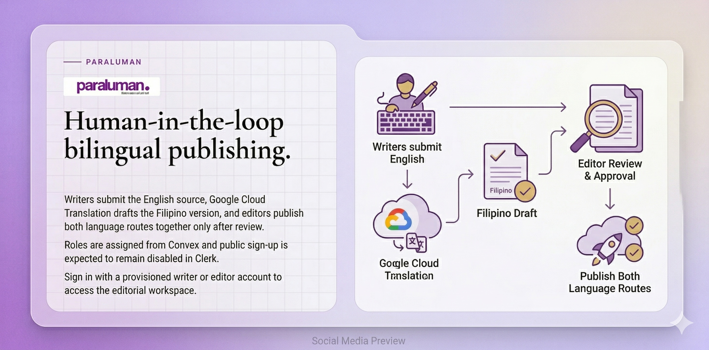

# Sabay Publish

A bilingual English-Filipino publishing workflow for Paraluman.



Sabay Publish helps a newsroom draft an English article, generate a Filipino translation draft, review both versions, and publish them together. The system keeps translation inside an editorial workflow: writers prepare the story, editors revise and approve the translated copy, and readers can switch between the two published versions.

## Editorial workflow

```text
English draft
    -> Google Cloud Translation draft
    -> editor review and revision
    -> approval
    -> publish English and Filipino versions
    -> reader language switcher
```

The implementation includes:

- separate writer and editor roles through Clerk;
- English article drafting with images, metadata, and publication state;
- Filipino translation drafts through Google Cloud Translation;
- an editor review workspace for revising and approving translated copy;
- a shared article record and status history in Convex;
- real-time updates across editorial views;
- a public bilingual article experience;
- Playwright coverage for the principal writer-to-editor workflow.

The repository contains the publishing application developed for [Paraluman](https://paraluman-web.vercel.app), a youth-led Philippine news project.

## Architecture

The application lives in [`web/`](web/) and uses Next.js, React, TypeScript, Convex, Clerk, Google Cloud Translation, Tailwind CSS, and shadcn/ui.

```text
web/src/       Next.js routes, editorial screens, and public pages
web/convex/    data model, article workflow, roles, and translation actions
web/e2e/       Playwright workflow coverage
assets/        presentation and repository visuals
```

## Run locally

```bash
git clone https://github.com/roivroberto/sabay-publish.git
cd sabay-publish/web
pnpm install
cp .env.example .env.local
```

Complete the Clerk and Convex values in `.env.local`. Google Cloud credentials are only required for provider-backed translation; the browser tests use a controlled translation path.

Start Convex and Next.js in separate terminals:

```bash
pnpm convex:dev
pnpm dev
```

## Verification

From `web/`:

```bash
pnpm lint
pnpm typecheck
pnpm build
pnpm test:e2e
```

See [`web/README.md`](web/README.md) for environment and deployment notes.

## Current scope

Sabay Publish supports a working bilingual editorial flow, but generated Filipino copy still requires editorial review. The project does not claim fully automatic or publication-ready translation without that review.

## License

Licensed under the [MIT License](LICENSE).
